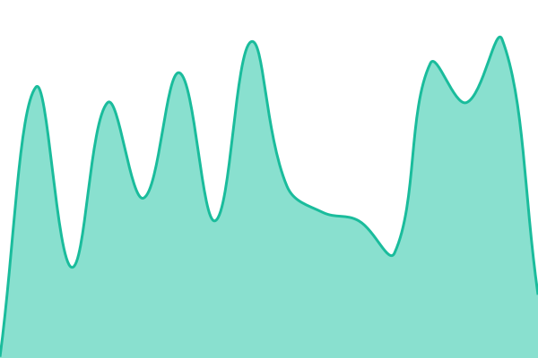
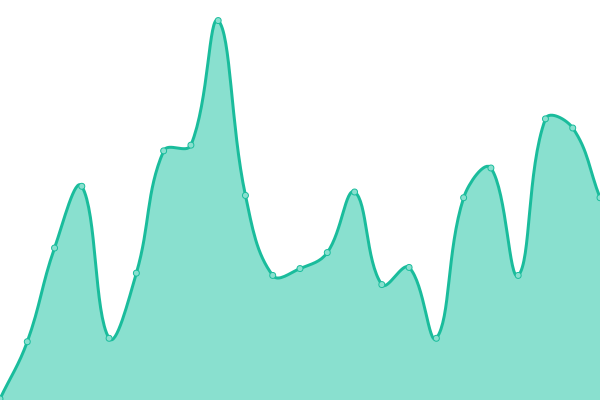
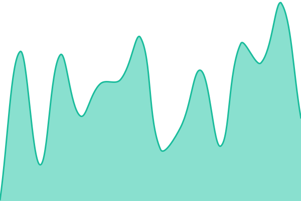

# [📈 Live Status](https://status.salaaz.com): <!--live status--> **🟩 All systems operational**

This repository contains the open-source uptime monitor and status page for [Muhammad Daniyal Arab](https://status.salaaz.com), powered by [Upptime](https://github.com/upptime/upptime).

With [Upptime](https://upptime.js.org), you can get your own unlimited and free uptime monitor and status page, powered entirely by a GitHub repository. We use [Issues](https://github.com/Dino-Dan/salaaz-status/issues) as incident reports, [Actions](https://github.com/Dino-Dan/salaaz-status/actions) as uptime monitors, and [Pages](https://status.salaaz.com) for the status page.

<!--start: status pages-->
<!-- This summary is generated by Upptime (https://github.com/upptime/upptime) -->
<!-- Do not edit this manually, your changes will be overwritten -->
<!-- prettier-ignore -->
| URL | Status | History | Response Time | Uptime |
| --- | ------ | ------- | ------------- | ------ |
|  [Salaaz Marketplace](https://salaaz.com/) | 🟩 Up | [salaaz-marketplace.yml](https://github.com/Dino-Dan/salaaz-status/commits/HEAD/history/salaaz-marketplace.yml) | 

 179ms
     
 | 

<a href="https://status.salaaz.com/history/salaaz-marketplace">100.00%</a>
    

|  [Vendor Portal](https://vendor.salaaz.com/) | 🟩 Up | [vendor-portal.yml](https://github.com/Dino-Dan/salaaz-status/commits/HEAD/history/vendor-portal.yml) | 

 180ms
     
 | 

<a href="https://status.salaaz.com/history/vendor-portal">100.00%</a>
    

|  [Ethics Dashboard](https://ethics.salaaz.com/) | 🟩 Up | [ethics-dashboard.yml](https://github.com/Dino-Dan/salaaz-status/commits/HEAD/history/ethics-dashboard.yml) | 

 186ms
     
 | 

<a href="https://status.salaaz.com/history/ethics-dashboard">100.00%</a>
    

<!--end: status pages-->

[**Visit our status website →**](https://status.salaaz.com)

## Dependency health checks

In addition to the three main Upptime-monitored services above, a separate GitHub Actions workflow (`eci-status.yml`) polls third-party dependencies every 5 minutes and writes their status to the `history/` directory. These are surfaced as amber badges in the "Dependencies" panel on the Salaaz Marketplace card.

| Badge        | What is checked                                                                                                  | Source file                       |
| ------------ | ---------------------------------------------------------------------------------------------------------------- | --------------------------------- |
| **API**      | `GET https://salaaz.com/health/` — django-health-check aggregating PostgreSQL, migrations, MongoDB, and Redis/RQ | `history/alibaba-ecs-status.json` |
| **Shipping** | StallionExpress API (`ship.stallionexpress.ca/api/v4`)                                                           | `history/stallion-status.json`    |
| **Payments** | Square API (`issquareup.com/api/v2/status.json`)                                                                 | `history/square-status.json`      |

Provider outages are capped at amber — red is reserved for Salaaz's own services being unreachable.

## 📄 License

- Powered by: [Upptime](https://github.com/upptime/upptime)
- Code: [MIT](./LICENSE) © [Anand Chowdhary](https://anandchowdhary.com), supported by [Pabio](https://pabio.com)
- Data in the `./history` directory: [Open Database License](https://opendatacommons.org/licenses/odbl/1-0/)
