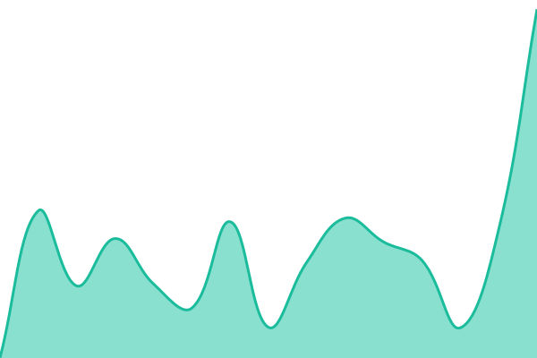
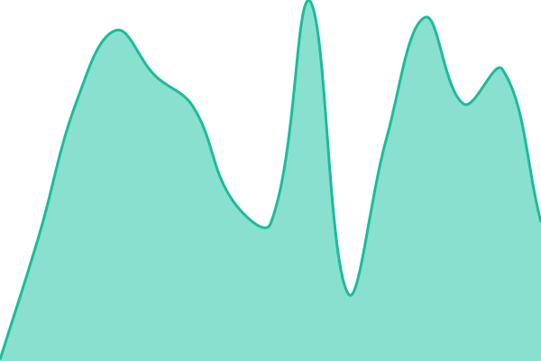
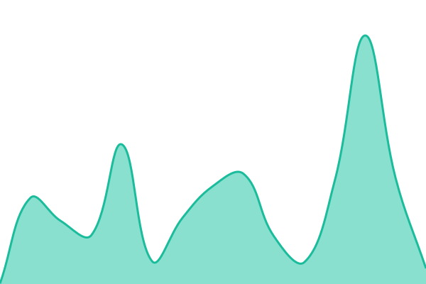

# [📈 Live Status](https://status.salaaz.com): <!--live status--> **🟧 Partial outage**

This repository contains the open-source uptime monitor and status page for [Muhammad Daniyal Arab](https://status.salaaz.com), powered by [Upptime](https://github.com/upptime/upptime).

[](https://github.com/Dino-Dan/salaaz-status/actions/workflows/uptime.yml)
[](https://github.com/Dino-Dan/salaaz-status/actions/workflows/response-time.yml)
[](https://github.com/Dino-Dan/salaaz-status/actions/workflows/graphs.yml)
[](https://github.com/Dino-Dan/salaaz-status/actions/workflows/site.yml)
[](https://github.com/Dino-Dan/salaaz-status/actions/workflows/summary.yml)

With [Upptime](https://upptime.js.org), you can get your own unlimited and free uptime monitor and status page, powered entirely by a GitHub repository. We use [Issues](https://github.com/Dino-Dan/salaaz-status/issues) as incident reports, [Actions](https://github.com/Dino-Dan/salaaz-status/actions) as uptime monitors, and [Pages](https://status.salaaz.com) for the status page.

<!--start: status pages-->
<!-- This summary is generated by Upptime (https://github.com/upptime/upptime) -->
<!-- Do not edit this manually, your changes will be overwritten -->
<!-- prettier-ignore -->
| URL | Status | History | Response Time | Uptime |
| --- | ------ | ------- | ------------- | ------ |
|  [Salaaz Marketplace](https://salaaz.com/) | 🟥 Down | [salaaz-marketplace.yml](https://github.com/Dino-Dan/salaaz-status/commits/HEAD/history/salaaz-marketplace.yml) | <details><summary> 356ms</summary><br><a href="https://status.salaaz.com/history/salaaz-marketplace"></a><br><a href="https://status.salaaz.com/history/salaaz-marketplace"></a><br><a href="https://status.salaaz.com/history/salaaz-marketplace"></a><br><a href="https://status.salaaz.com/history/salaaz-marketplace"></a><br><a href="https://status.salaaz.com/history/salaaz-marketplace"></a></details> | <details><summary><a href="https://status.salaaz.com/history/salaaz-marketplace">99.95%</a></summary><a href="https://status.salaaz.com/history/salaaz-marketplace"></a><br><a href="https://status.salaaz.com/history/salaaz-marketplace"></a><br><a href="https://status.salaaz.com/history/salaaz-marketplace"></a><br><a href="https://status.salaaz.com/history/salaaz-marketplace"></a><br><a href="https://status.salaaz.com/history/salaaz-marketplace"></a></details>
|  [Vendor Portal](https://vendor.salaaz.com/) | 🟩 Up | [vendor-portal.yml](https://github.com/Dino-Dan/salaaz-status/commits/HEAD/history/vendor-portal.yml) | <details><summary> 186ms</summary><br><a href="https://status.salaaz.com/history/vendor-portal"></a><br><a href="https://status.salaaz.com/history/vendor-portal"></a><br><a href="https://status.salaaz.com/history/vendor-portal"></a><br><a href="https://status.salaaz.com/history/vendor-portal"></a><br><a href="https://status.salaaz.com/history/vendor-portal"></a></details> | <details><summary><a href="https://status.salaaz.com/history/vendor-portal">99.95%</a></summary><a href="https://status.salaaz.com/history/vendor-portal"></a><br><a href="https://status.salaaz.com/history/vendor-portal"></a><br><a href="https://status.salaaz.com/history/vendor-portal"></a><br><a href="https://status.salaaz.com/history/vendor-portal"></a><br><a href="https://status.salaaz.com/history/vendor-portal"></a></details>
|  [Ethics Dashboard](https://ethics.salaaz.com/) | 🟥 Down | [ethics-dashboard.yml](https://github.com/Dino-Dan/salaaz-status/commits/HEAD/history/ethics-dashboard.yml) | <details><summary> 246ms</summary><br><a href="https://status.salaaz.com/history/ethics-dashboard"></a><br><a href="https://status.salaaz.com/history/ethics-dashboard"></a><br><a href="https://status.salaaz.com/history/ethics-dashboard"></a><br><a href="https://status.salaaz.com/history/ethics-dashboard"></a><br><a href="https://status.salaaz.com/history/ethics-dashboard"></a></details> | <details><summary><a href="https://status.salaaz.com/history/ethics-dashboard">99.96%</a></summary><a href="https://status.salaaz.com/history/ethics-dashboard"></a><br><a href="https://status.salaaz.com/history/ethics-dashboard"></a><br><a href="https://status.salaaz.com/history/ethics-dashboard"></a><br><a href="https://status.salaaz.com/history/ethics-dashboard"></a><br><a href="https://status.salaaz.com/history/ethics-dashboard"></a></details>

<!--end: status pages-->

[**Visit our status website →**](https://status.salaaz.com)

## Dependency health checks

In addition to the three main Upptime-monitored services above, a separate GitHub Actions workflow (`eci-status.yml`) polls third-party dependencies every 5 minutes and writes their status to the `history/` directory. These are surfaced as amber badges in the "Dependencies" panel on the Salaaz Marketplace card.

| Badge        | What is checked                                                                                                  | Source file                       |
| ------------ | ---------------------------------------------------------------------------------------------------------------- | --------------------------------- |
| **API**      | `GET https://salaaz.com/health/` — django-health-check aggregating PostgreSQL, migrations, MongoDB, and Redis/RQ | `history/alibaba-ecs-status.json` |
| **Shipping** | Stallion Express public status page (`status.stallionexpress.ca`)                                                | `history/stallion-status.json`    |
| **Payments** | Square API (`issquareup.com/api/v2/status.json`)                                                                 | `history/square-status.json`      |

Provider outages are capped at amber — red is reserved for Salaaz's own services being unreachable.

## Feed and API

Published to `status.salaaz.com` on every deploy, generated from `history/` by `scripts/build-feed.mjs` and `scripts/build-api.mjs`.

| Endpoint                                                  | What it gives you                                                      |
| --------------------------------------------------------- | ---------------------------------------------------------------------- |
| [`/feed.xml`](https://status.salaaz.com/feed.xml)         | Atom 1.0 incident feed — the 50 most recent public incidents           |
| [`/status.json`](https://status.salaaz.com/status.json)   | Overall indicator: `none` \| `degraded` \| `major`, plus a description |
| [`/summary.json`](https://status.salaaz.com/summary.json) | Per-service status, 90-day uptime, response time, and active incidents |

```console
$ curl -s https://status.salaaz.com/status.json | jq -r '.status.description'
All systems operational
```

Both exclude internal-only services and `internal`-labelled alert issues, so they show exactly what the public page shows.

## Alerting

Outage alerts reach Discord through a GitHub → Discord webhook subscribed to **issue events**, configured in GitHub/Discord — not in this repo. Anything that opens an issue therefore alerts automatically.

Upptime opens issues for HTTP failures on the three monitored URLs. The smoke checks (`vendor-smoke.yml`, `ethics-smoke.yml`) and the dependency pings (`eci-status.yml`) catch failures HTTP checks cannot see — a page returning 200 while rendering nothing, or a third-party provider going down — so they open issues too, via `.github/actions/alert-issue`. Those carry the `internal` label and are filtered out of the public page and the feed.

One issue per failing thing; it closes automatically on recovery.

## Development

```console
$ npm install
$ npm test          # 79 unit (vitest) + 102 e2e (playwright)
```

The suite gates deploys — see `.github/workflows/test.yml`, which `deploy-status-page.yml` depends on.

## 📄 License

- Powered by: [Upptime](https://github.com/upptime/upptime)
- Code: [MIT](./LICENSE) © [Anand Chowdhary](https://anandchowdhary.com), supported by [Pabio](https://pabio.com)
- Data in the `./history` directory: [Open Database License](https://opendatacommons.org/licenses/odbl/1-0/)
